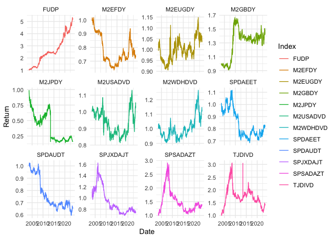

# Objective

The goal is to assess the performance of dividend yield as an investment
strategy. I plan to optimize portfolios of the highest paying dividend
stock and/or highest growth in dividends for a group of assets.

-   First calculate the excess returns for indices and their benchmarks
-   Explain relationships within the return series for each region with
    and without stratifying the sample.
-   Then maybe look to build own dividend portfolios to see how that
    would have performed.

# Instruments

To investigate the performance of dividend paying strategies, either
dividend yield or dividend growth I will consider globally traded
indices and their benchmarks. For concreteness, I will look at those
prescribed in literature. From this I will find the excess return.

| TICKER   | NAME                                                                      | Benchmark Ticker | Benchmark Name                          |
|:-----|:------------------------------------|:---------|:--------------------|
| FUDP     | FTSE UK Dividend+ Index                                                   | TUKXG            | FTSE 100 Total Return Index GBP         |
| M2EFDY   | MSCI EM Emerging Markets High Dividend Yield Gross Total Return USD Index | GDUEEGF          | MSCI Daily TR Gross EM USD              |
| M2GBDY   | MSCI United Kingdom High Dividend Yield Gross Total Return USD Index      | GDDUUK           | MSCI UK Gross Total Return USD Index    |
| M2JPDY   | MSCI Japan High Dividend Yield Gross Total Return USD                     | TPXDDVD          | Topix Total Return Index JPY            |
| M2USADVD | MSCI USA Hdy Gross Total Return USD Index                                 | GDDUUS           | MSCI Daily TR Gross USA USD             |
| M2WDHDVD | MSCI World HIGH DIVIDEND YIELD Gross Total Return Total Return USD Index  | GDDUWI           | MSCI Daily TR Gross World USD           |
| SPDAEET  | S&P Europe 350 Dividends Aristocrats Total Return Index                   | SPTR350E         | S&P Europe 350 Gross Total Return Index |
| SPJXDAJT | S&P/JPX Dividend Aristocrats Total Return Index                           | SPXT             | S&P 500 Total Return Index              |
| SPDAUDT  | S&P 500 Dividend Aristocrats Total Return Index                           | SPXT             | S&P 500 Total Return Index              |
| SPSADAZT | S&P South Africa Dividend Aristocrats Index ZAR Gross TR                  | JALSH            | FTSE/JSE Africa All Share Index         |
| TJDIVD   | FTSE/JSE Dividend+ Index Total Return Index                               | JALSH            | FTSE/JSE Africa All Share Index         |
| M2EUGDY  | MSCI Europe Ex UK High Dividend Yield Gross Total Return USD Index        | GDDUE15X         | MSCI Daily TR Gross Europe Ex UK USD    |

## Excess Return

I calculate excess returns as the monthly difference return for index
and benchmark, then calculate cumulative returns for the result.

The indices across regions have different inception dates therefore not
purely comparable across regions.

From the figure below, results of dividend strategies (High Yield or
Dividend Growth) at different inception dates have been consistently
returned a positive excess over the market index, even though sometimes
volatile. This shows full sample performance.

-   consider the mix between high dividend yield versus dividend growth
    portfolios, so color coordinate the different strategies?

 \##
Performance Stats

``` r
funds <- readxl::read_xlsx("data/MAD .xlsx")
source("code/Statistics.R")

funds <- funds %>% 
  gather(Tickers, Value, -Date) %>% 
  arrange(Date) %>% group_by(Tickers) %>%
  mutate(Ret = Value/lag(Value)-1) %>% 
  mutate(Ret =coalesce(Ret,0)) %>% 
  ungroup()

BM <- "TUKXG"

One_year <- funds %>% Moments_Comp(., BM = BM, Yrs_LookBack = 1, NA_Check = 0.9)
Three_year <- funds %>% Moments_Comp(., BM = BM, Yrs_LookBack = 3, NA_Check = 0.9)
Five_year <- funds %>% Moments_Comp(., BM = BM, Yrs_LookBack = 5, NA_Check = 0.9)

kable(One_year)
```

| Period       | Info                  |   FUDP | M2EFDY |  TUKXG | GDUEEGF | M2GBDY | GDDUUK | M2JPDY | GDDUE15X | M2USADVD | GDDUUS | M2WDHDVD | GDDUWI | SPDAEET | SPTR350E | SPJXDAJT | SPDAUDT |   SPXT | TPXDDVD | SPSADAZT |  JALSH | TJDIVD | M2EUGDY |
|:---|:------|--:|--:|--:|--:|--:|--:|--:|---:|---:|--:|---:|--:|--:|---:|---:|--:|--:|--:|---:|--:|--:|--:|
| Last 1 Years | Cum Returns           | -0.040 |  0.133 |  0.078 |   0.052 |  0.128 |  0.166 |  0.219 |    0.277 |    0.091 |  0.158 |    0.129 |  0.167 |   0.072 |    0.133 |    0.287 |   0.157 |  0.208 |   0.229 |    0.055 |  0.090 | -0.100 |   0.294 |
| Last 1 Years | Returns (Ann.)        | -0.002 |  0.006 |  0.004 |   0.003 |  0.006 |  0.008 |  0.010 |    0.012 |    0.004 |  0.007 |    0.006 |  0.008 |   0.003 |    0.006 |    0.012 |   0.007 |  0.009 |   0.010 |    0.003 |  0.004 | -0.005 |   0.013 |
| Last 1 Years | Returns Excess (Ann.) | -0.113 |  0.053 |  0.000 |  -0.024 |  0.048 |  0.085 |  0.136 |    0.191 |    0.012 |  0.077 |    0.049 |  0.085 |  -0.006 |    0.053 |    0.201 |   0.076 |  0.125 |   0.145 |   -0.022 |  0.012 | -0.170 |   0.208 |
| Last 1 Years | SD (Ann.)             |  0.033 |  0.029 |  0.026 |   0.035 |  0.050 |  0.040 |  0.038 |    0.044 |    0.033 |  0.040 |    0.026 |  0.035 |   0.032 |    0.030 |    0.028 |   0.036 |  0.039 |   0.029 |    0.043 |  0.036 |  0.042 |   0.041 |
| Last 1 Years | Adj. Sharpe Ratio     | -0.271 |  1.003 |  0.581 |   0.344 |  0.561 |  0.806 |  1.265 |    1.296 |    0.620 |  0.866 |    1.071 |  1.027 |   0.517 |    0.905 |    0.406 |   0.983 |  1.099 |   1.569 |    0.297 |  0.568 | -0.524 |   1.415 |
| Last 1 Years | Pain Index            |  0.057 |  0.026 |  0.021 |   0.052 |  0.066 |  0.031 |  0.022 |    0.029 |    0.035 |  0.033 |    0.023 |  0.029 |   0.027 |    0.021 |    0.018 |   0.027 |  0.028 |   0.021 |    0.064 |  0.042 |  0.096 |   0.027 |
| Last 1 Years | Avg DD                |  0.033 |  0.024 |  0.021 |   0.057 |  0.040 |  0.031 |  0.024 |    0.036 |    0.034 |  0.027 |    0.023 |  0.027 |   0.029 |    0.021 |    0.019 |   0.027 |  0.020 |   0.024 |    0.032 |  0.027 |  0.050 |   0.022 |
| Last 1 Years | Tracking Error        |  0.016 |  0.032 |  0.000 |   0.037 |  0.038 |  0.026 |  0.045 |    0.031 |    0.032 |  0.038 |    0.024 |  0.030 |   0.024 |    0.016 |    0.036 |   0.035 |  0.037 |   0.035 |    0.038 |  0.029 |  0.038 |   0.029 |
| Last 1 Years | Information Ratio     | -1.611 |  0.388 |    NaN |  -0.156 |  0.295 |  0.755 |  0.718 |    1.441 |    0.089 |  0.480 |    0.477 |  0.662 |  -0.056 |    0.771 |    1.311 |   0.518 |  0.786 |   0.969 |   -0.135 |  0.096 | -1.068 |   1.711 |
| Last 1 Years | Beta                  |  1.106 |  0.363 |  1.000 |   0.397 |  1.274 |  1.157 |  0.090 |    1.195 |    0.535 |  0.628 |    0.580 |  0.706 |   0.827 |    0.956 |    0.112 |   0.553 |  0.604 |   0.180 |    0.784 |  0.850 |  0.732 |   1.149 |
| Last 1 Years | Beta Bull             |  1.158 |  0.311 |  1.000 |   0.345 |  1.377 |  1.171 |  0.117 |    1.280 |    0.660 |  0.790 |    0.700 |  0.821 |   0.790 |    0.894 |   -0.081 |   0.699 |  0.776 |   0.026 |    1.237 |  1.011 |  0.842 |   1.294 |
| Last 1 Years | Beta Bear             |  1.072 |  0.282 |  1.000 |   0.283 |  1.144 |  1.161 |  0.111 |    1.116 |    0.349 |  0.375 |    0.412 |  0.518 |   0.650 |    0.914 |    0.181 |   0.435 |  0.377 |   0.278 |    0.399 |  0.763 |  0.565 |   1.096 |
| Last 1 Years | Up-Down Ratio         |  0.469 |  0.383 |  0.000 |   0.391 |  0.570 |  0.586 |  0.422 |    0.586 |    0.383 |  0.430 |    0.414 |  0.469 |   0.477 |    0.547 |    0.391 |   0.359 |  0.438 |   0.352 |    0.461 |  0.484 |  0.438 |   0.586 |
| Last 1 Years | Modified CVaR         | -0.022 | -0.015 | -0.023 |  -0.017 | -0.032 | -0.030 | -0.022 |   -0.026 |   -0.019 | -0.022 |   -0.014 | -0.018 |  -0.018 |   -0.020 |   -0.022 |  -0.019 | -0.021 |  -0.017 |   -0.021 | -0.018 | -0.026 |  -0.025 |

``` r
kable(Three_year)
```

| Period       | Info                  |   FUDP | M2EFDY |  TUKXG | GDUEEGF | M2GBDY | GDDUUK | M2JPDY | GDDUE15X | M2USADVD | GDDUUS | M2WDHDVD | GDDUWI | SPDAEET | SPTR350E | SPJXDAJT | SPDAUDT |   SPXT | TPXDDVD | SPSADAZT |  JALSH | TJDIVD | M2EUGDY |
|:---|:------|--:|--:|--:|--:|--:|--:|--:|---:|---:|--:|---:|--:|--:|---:|---:|--:|--:|--:|---:|--:|--:|--:|
| Last 3 Years | Cum Returns           |  0.136 |  0.154 |  0.347 |   0.004 |  0.288 |  0.371 |  0.376 |    0.255 |    0.304 |  0.328 |    0.304 |  0.298 |   0.217 |    0.391 |    0.581 |   0.562 |  0.454 |   0.451 |    0.341 |  0.304 |  0.504 |   0.273 |
| Last 3 Years | Returns (Ann.)        |  0.002 |  0.002 |  0.005 |   0.000 |  0.004 |  0.005 |  0.005 |    0.004 |    0.004 |  0.004 |    0.004 |  0.004 |   0.003 |    0.005 |    0.007 |   0.007 |  0.006 |   0.006 |    0.005 |  0.004 |  0.006 |   0.004 |
| Last 3 Years | Returns Excess (Ann.) | -0.055 | -0.050 |  0.000 |  -0.092 | -0.015 |  0.006 |  0.007 |   -0.023 |   -0.010 | -0.005 |   -0.011 | -0.012 |  -0.033 |    0.011 |    0.054 |   0.050 |  0.026 |   0.025 |   -0.001 | -0.011 |  0.037 |  -0.018 |
| Last 3 Years | SD (Ann.)             |  0.035 |  0.030 |  0.031 |   0.036 |  0.047 |  0.041 |  0.036 |    0.043 |    0.031 |  0.040 |    0.026 |  0.034 |   0.031 |    0.033 |    0.032 |   0.034 |  0.039 |   0.032 |    0.044 |  0.037 |  0.042 |   0.040 |
| Last 3 Years | Adj. Sharpe Ratio     |  0.265 |  0.345 |  0.647 |   0.008 |  0.390 |  0.535 |  0.666 |    0.387 |    0.617 |  0.512 |    0.732 |  0.554 |   0.466 |    0.692 |    1.037 |   0.924 |  0.693 |   0.854 |    0.510 |  0.529 |  0.727 |   0.434 |
| Last 3 Years | Pain Index            |  0.070 |  0.113 |  0.021 |   0.179 |  0.077 |  0.046 |  0.063 |    0.084 |    0.033 |  0.077 |    0.036 |  0.074 |   0.066 |    0.037 |    0.048 |   0.032 |  0.059 |   0.043 |    0.054 |  0.045 |  0.058 |   0.075 |
| Last 3 Years | Avg DD                |  0.030 |  0.034 |  0.023 |   0.037 |  0.042 |  0.033 |  0.028 |    0.029 |    0.020 |  0.020 |    0.019 |  0.021 |   0.022 |    0.018 |    0.027 |   0.022 |  0.018 |   0.029 |    0.042 |  0.031 |  0.036 |   0.030 |
| Last 3 Years | Tracking Error        |  0.014 |  0.032 |  0.000 |   0.037 |  0.033 |  0.022 |  0.045 |    0.028 |    0.032 |  0.040 |    0.024 |  0.031 |   0.023 |    0.016 |    0.040 |   0.035 |  0.038 |   0.039 |    0.040 |  0.030 |  0.037 |   0.025 |
| Last 3 Years | Information Ratio     | -0.915 | -0.372 |    NaN |  -0.604 | -0.108 |  0.064 |  0.037 |   -0.199 |   -0.078 | -0.029 |   -0.108 | -0.095 |  -0.345 |    0.160 |    0.322 |   0.348 |  0.160 |   0.154 |   -0.008 | -0.085 |  0.243 |  -0.175 |
| Last 3 Years | Beta                  |  1.021 |  0.417 |  1.000 |   0.464 |  1.111 |  1.145 |  0.119 |    1.054 |    0.458 |  0.521 |    0.548 |  0.607 |   0.718 |    0.933 |    0.176 |   0.478 |  0.503 |   0.253 |    0.666 |  0.742 |  0.707 |   1.012 |
| Last 3 Years | Beta Bull             |  0.992 |  0.256 |  1.000 |   0.255 |  1.025 |  1.123 |  0.087 |    1.004 |    0.563 |  0.581 |    0.607 |  0.622 |   0.688 |    0.891 |    0.089 |   0.612 |  0.587 |   0.148 |    0.729 |  0.639 |  0.668 |   1.040 |
| Last 3 Years | Beta Bear             |  1.024 |  0.532 |  1.000 |   0.570 |  1.129 |  1.202 |  0.170 |    1.122 |    0.413 |  0.445 |    0.547 |  0.577 |   0.689 |    0.961 |    0.237 |   0.438 |  0.423 |   0.348 |    0.624 |  0.832 |  0.761 |   1.087 |
| Last 3 Years | Up-Down Ratio         |  0.449 |  0.336 |  0.000 |   0.366 |  0.530 |  0.571 |  0.328 |    0.505 |    0.308 |  0.409 |    0.308 |  0.412 |   0.384 |    0.482 |    0.333 |   0.346 |  0.399 |   0.328 |    0.396 |  0.412 |  0.407 |   0.455 |
| Last 3 Years | Modified CVaR         | -0.025 | -0.022 | -0.024 |  -0.022 | -0.033 | -0.032 | -0.021 |   -0.029 |   -0.021 | -0.028 |   -0.017 | -0.023 |  -0.020 |   -0.024 |   -0.020 |  -0.022 | -0.027 |  -0.020 |   -0.023 | -0.023 | -0.026 |  -0.028 |

``` r
kable(Five_year)
```

| Period       | Info                  |   FUDP | M2EFDY |  TUKXG | GDUEEGF | M2GBDY | GDDUUK | M2JPDY | GDDUE15X | M2USADVD | GDDUUS | M2WDHDVD | GDDUWI | SPDAEET | SPTR350E | SPJXDAJT | SPDAUDT |   SPXT | TPXDDVD | SPSADAZT |  JALSH | TJDIVD | M2EUGDY |
|:---|:------|--:|--:|--:|--:|--:|--:|--:|---:|---:|--:|---:|--:|--:|---:|---:|--:|--:|--:|---:|--:|--:|--:|
| Last 5 Years | Cum Returns           | -0.257 |  0.078 |  0.182 |   0.107 |  0.110 |  0.202 |  0.300 |    0.368 |    0.406 |  0.689 |    0.386 |  0.536 |   0.280 |    0.406 |    0.368 |   0.835 |  0.764 |   0.433 |    0.026 |  0.218 |  0.405 |   0.316 |
| Last 5 Years | Returns (Ann.)        | -0.003 |  0.001 |  0.002 |   0.001 |  0.001 |  0.002 |  0.002 |    0.003 |    0.003 |  0.005 |    0.003 |  0.004 |   0.002 |    0.003 |    0.003 |   0.006 |  0.005 |   0.003 |    0.000 |  0.002 |  0.003 |   0.003 |
| Last 5 Years | Returns Excess (Ann.) | -0.087 | -0.018 |  0.000 |  -0.013 | -0.012 |  0.003 |  0.019 |    0.029 |    0.035 |  0.072 |    0.032 |  0.053 |   0.016 |    0.034 |    0.029 |   0.090 |  0.082 |   0.038 |   -0.027 |  0.006 |  0.034 |   0.021 |
| Last 5 Years | SD (Ann.)             |  0.045 |  0.034 |  0.038 |   0.038 |  0.053 |  0.046 |  0.039 |    0.044 |    0.041 |  0.047 |    0.033 |  0.040 |   0.036 |    0.038 |    0.035 |   0.043 |  0.046 |   0.035 |    0.045 |  0.042 |  0.046 |   0.044 |
| Last 5 Years | Adj. Sharpe Ratio     | -0.272 |  0.095 |  0.182 |   0.114 |  0.084 |  0.167 |  0.294 |    0.283 |    0.324 |  0.414 |    0.338 |  0.389 |   0.274 |    0.326 |    0.385 |   0.459 |  0.433 |   0.436 |    0.024 |  0.197 |  0.313 |   0.244 |
| Last 5 Years | Pain Index            |  0.152 |  0.108 |  0.057 |   0.134 |  0.109 |  0.075 |  0.078 |    0.077 |    0.038 |  0.065 |    0.044 |  0.065 |   0.075 |    0.056 |    0.074 |   0.037 |  0.055 |   0.053 |    0.102 |  0.060 |  0.076 |   0.076 |
| Last 5 Years | Avg DD                |  0.471 |  0.049 |  0.040 |   0.043 |  0.078 |  0.058 |  0.045 |    0.038 |    0.024 |  0.022 |    0.024 |  0.025 |   0.032 |    0.026 |    0.039 |   0.024 |  0.022 |   0.042 |    0.065 |  0.045 |  0.042 |   0.040 |
| Last 5 Years | Tracking Error        |  0.020 |  0.033 |  0.000 |   0.036 |  0.035 |  0.022 |  0.049 |    0.026 |    0.036 |  0.041 |    0.025 |  0.031 |   0.022 |    0.016 |    0.043 |   0.037 |  0.040 |   0.043 |    0.040 |  0.032 |  0.037 |   0.025 |
| Last 5 Years | Information Ratio     | -0.989 | -0.122 |    NaN |  -0.079 | -0.079 |  0.033 |  0.087 |    0.251 |    0.218 |  0.400 |    0.283 |  0.383 |   0.161 |    0.478 |    0.151 |   0.551 |  0.461 |   0.204 |   -0.153 |  0.041 |  0.209 |   0.193 |
| Last 5 Years | Beta                  |  1.056 |  0.510 |  1.000 |   0.547 |  1.074 |  1.079 |  0.204 |    0.948 |    0.641 |  0.700 |    0.657 |  0.716 |   0.782 |    0.923 |    0.272 |   0.684 |  0.688 |   0.307 |    0.648 |  0.759 |  0.753 |   0.961 |
| Last 5 Years | Beta Bull             |  1.079 |  0.427 |  1.000 |   0.444 |  1.089 |  1.109 |  0.266 |    0.903 |    0.710 |  0.770 |    0.696 |  0.753 |   0.764 |    0.880 |    0.239 |   0.806 |  0.763 |   0.282 |    0.627 |  0.694 |  0.731 |   0.995 |
| Last 5 Years | Beta Bear             |  1.099 |  0.611 |  1.000 |   0.633 |  1.138 |  1.111 |  0.257 |    0.983 |    0.759 |  0.801 |    0.756 |  0.804 |   0.829 |    0.976 |    0.360 |   0.791 |  0.794 |   0.394 |    0.691 |  0.857 |  0.810 |   1.031 |
| Last 5 Years | Up-Down Ratio         |  0.442 |  0.339 |  0.000 |   0.360 |  0.500 |  0.521 |  0.310 |    0.480 |    0.322 |  0.396 |    0.301 |  0.387 |   0.368 |    0.457 |    0.294 |   0.348 |  0.387 |   0.288 |    0.390 |  0.390 |  0.414 |   0.443 |
| Last 5 Years | Modified CVaR         | -0.037 | -0.033 | -0.040 |  -0.033 | -0.043 | -0.040 | -0.025 |   -0.049 |   -0.022 | -0.039 |   -0.030 | -0.039 |  -0.040 |   -0.046 |   -0.024 |  -0.028 | -0.036 |  -0.023 |   -0.034 | -0.041 | -0.039 |  -0.044 |

## Stratification to diffrent time periods
