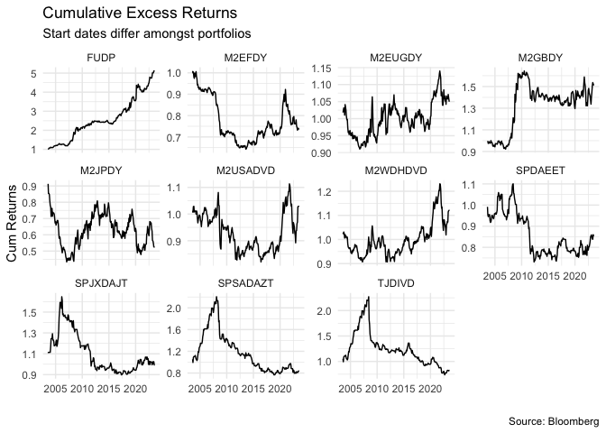

# Objective

The goal is to assess the performance of dividend yield as an investment
strategy. I plan to optimize portfolios of the highest paying dividend
stock and/or highest growth in dividends for a group of assets.

-   First calculate the excess returns for indices and their benchmarks
-   Explain relationships within the return series for each region with
    and without stratifying the sample.
-   Then maybe look to build own dividend portfolios to see how that
    would have performed.

# Instruments

To investigate the performance of dividend paying strategies, either
dividend yield or dividend growth I will consider globally traded
indices and their benchmarks. For concreteness, I will look at those
prescribed in literature. From this I will find the excess return.

| TICKER   | NAME                                                                      | Benchmark Ticker | Benchmark Name                          |
|:-----|:------------------------------------|:---------|:--------------------|
| FUDP     | FTSE UK Dividend+ Index                                                   | TUKXG            | FTSE 100 Total Return Index GBP         |
| M2EFDY   | MSCI EM Emerging Markets High Dividend Yield Gross Total Return USD Index | GDUEEGF          | MSCI Daily TR Gross EM USD              |
| M2GBDY   | MSCI United Kingdom High Dividend Yield Gross Total Return USD Index      | GDDUUK           | MSCI UK Gross Total Return USD Index    |
| M2JPDY   | MSCI Japan High Dividend Yield Gross Total Return USD                     | TPXDDVD          | Topix Total Return Index JPY            |
| M2USADVD | MSCI USA Hdy Gross Total Return USD Index                                 | GDDUUS           | MSCI Daily TR Gross USA USD             |
| M2WDHDVD | MSCI World HIGH DIVIDEND YIELD Gross Total Return Total Return USD Index  | GDDUWI           | MSCI Daily TR Gross World USD           |
| SPDAEET  | S&P Europe 350 Dividends Aristocrats Total Return Index                   | SPTR350E         | S&P Europe 350 Gross Total Return Index |
| SPJXDAJT | S&P/JPX Dividend Aristocrats Total Return Index                           | SPXT             | S&P 500 Total Return Index              |
| SPDAUDT  | S&P 500 Dividend Aristocrats Total Return Index                           | SPXT             | S&P 500 Total Return Index              |
| SPSADAZT | S&P South Africa Dividend Aristocrats Index ZAR Gross TR                  | JALSH            | FTSE/JSE Africa All Share Index         |
| TJDIVD   | FTSE/JSE Dividend+ Index Total Return Index                               | JALSH            | FTSE/JSE Africa All Share Index         |
| M2EUGDY  | MSCI Europe Ex UK High Dividend Yield Gross Total Return USD Index        | GDDUE15X         | MSCI Daily TR Gross Europe Ex UK USD    |

## Excess Return

I calculate excess returns as the monthly difference return for index
and benchmark, then calculate cumulative returns for the result.

The indices across regions have different inception dates therefore not
purely comparable across regions.

From the figure below, results of dividend strategies (High Yield or
Dividend Growth) at different inception dates have been consistently
returned a positive excess over the market index, even though sometimes
volatile. This shows full sample performance.

-   consider the mix between high dividend yield versus dividend growth
    portfolios, so color coordinate the different strategies?

``` r
# loadings 
pacman::p_load("xts", "tidyverse", "tbl2xts", "PerformanceAnalytics", 
               "lubridate", "glue")
library(tbl2xts)
library(tidyverse)
library(xts)
source("code/EXCESSRETURN.R")
source("code/EXCESSRETURN2.R")
source("code/monthlyreturns.R")
library(quantmod)
source("code/uncompoundedexcess.R")
source("code/simpleexcessreturn.R")

df <- readxl::read_xlsx("data/MAD .xlsx") 

# get all permutatation 
A <- df %>% MY_excess_return(.,"FUDP", "TUKXG") 
B <- df %>% MY_excess_return(., "M2EFDY", "GDUEEGF") 
C <- df %>% MY_excess_return(., "M2EUGDY", "GDDUE15X") 
D <- df %>% MY_excess_return(., "M2GBDY", "GDDUUK") 
E <- df %>% MY_excess_return(., "M2JPDY", "TJDIVD") 
F1 <- df %>% MY_excess_return(., "M2USADVD", "GDDUUS") 
G <- df %>% MY_excess_return(., "M2WDHDVD", "GDDUWI") 
H <- df %>% MY_excess_return(., "SPDAEET", "SPTR350E") 
I <- df %>% MY_excess_return(., "SPDAUDT", "SPXT") 
J <- df %>% MY_excess_return(., "SPJXDAJT", "TPXDDVD") 
K <- df %>% MY_excess_return(., "SPSADAZT", "JALSH") 
L <- df %>% MY_excess_return(., "TJDIVD", "JALSH")

#  cumulative excess returns in a single data frame
compare <- list(A, B, C, D, E, F1, G,H,J, K, L) %>%
  reduce(inner_join, by='date') %>% gather(ticker, excess, -date)

plot <- compare %>% ggplot(aes(x = date, y = excess)) +
  geom_line() +
  labs(x = "Date", y = "Return") +
  theme_minimal() +
  facet_wrap(~ ticker, scales = "free_y", ncol = 4)+
   labs(
    title = "Cumulative Excess Returns",
    subtitle = "Start dates differ amongst portfolios",
    x = "",
    y = "Cum Returns",
    caption = "Source: Bloomberg"
  )

plot
```



``` r
# Now for standard deviation 
```

## Stratification

Applying a top down approach means that it would be prudent to consider
returns of the dividend portfolios under different time periods

I will use volatility and interest rate cycles.

-   For volatility I will use the historical series for the CBOE VIX
    index. I will get the roll standard deviation and separate values
    according to their percentile to get periods that expirienced the
    most volatility during the period. then bucket the two periods in
    either low or high vol So periods of high volatility and low
    volatility.

-   then annulized measure to get out excess returns on a three, five
    and ten year basis.

-   For interest rate cycles use periods of interest cutting and hiking.

\_ rolling returns, cant you rank them on

``` r
# get vol data from yahoo 

vix <- getSymbols("VIX")
VIX <- VIX %>% tbl2xts::xts_tbl(.)
VIX <- VIX %>% select(date, VIX.Close)

# get rolling sd for the volatility index 

Roll.sd <- VIX%>% rename(Close = VIX.Close) %>% 
  mutate(Ret = log(Close)- lag (log(Close))) %>% 
  filter(date > first(date)) %>% 
  mutate(RollSD = RcppRoll::roll_sd(1 + Ret, 12, fill = NA, align = "right") * 
    sqrt(12))

Roll.sd <- Roll.sd %>% filter(!is.na(RollSD))

# get the top quartile and bottom quartile

strat_df <- 
Roll.sd %>% mutate(topQ = quantile(RollSD, probs = 0.8), 
              botQ = quantile(RollSD, probs = 0.2),
              Strat = ifelse(RollSD >= topQ, "HiVol", 
                          ifelse(RollSD <= botQ, "LowVol", "Normal_Vol")))

hivol_per_vector <- strat_df %>% filter(Strat %in% "HiVol") %>% pull(date)
lovol_per_vector <- strat_df %>% filter(Strat %in% "LowVol") %>% pull(date)


# get entire returns and apply the vector above 
# voldata <-df %>% monthlyret(.) 

# get all permutatation 
A <- df %>% simple_excess_return(.,"FUDP", "TUKXG") 
B <- df %>% simple_excess_return(., "M2EFDY", "GDUEEGF") 
C <- df %>% simple_excess_return(., "M2EUGDY", "GDDUE15X") 
D <- df %>% simple_excess_return(., "M2GBDY", "GDDUUK") 
E <- df %>% simple_excess_return(., "M2JPDY", "TJDIVD") 
F1 <- df %>% simple_excess_return(., "M2USADVD", "GDDUUS") 
G <- df %>% simple_excess_return(., "M2WDHDVD", "GDDUWI") 
H <- df %>% simple_excess_return(., "SPDAEET", "SPTR350E") 
I <- df %>% simple_excess_return(., "SPDAUDT", "SPXT") 
J <- df %>% simple_excess_return(., "SPJXDAJT", "TPXDDVD") 
K <- df %>% simple_excess_return(., "SPSADAZT", "JALSH") 
L <- df %>% simple_excess_return(., "TJDIVD", "JALSH")

#  cexcess returns in a single data frame
excessreturns <- list(A, B, C, D, E, F1, G,H,J, K, L) %>%
  reduce(inner_join, by='date') %>% gather(ticker, excess, -date)

# hivol <- voldata %>%
#   filter(Date %in% hivol_per_vector) %>% 
#   filter(Date >= fmxdat::safe_month_min(last(Date), N = 36)) %>%
#   group_by(Tickers) %>% 
#   summarise(Hivol_return = prod(1+ret, na.rm=T) ^ (12/(36)) -1 ) 
# 
# lovol <-  voldata %>%
#   filter(Date %in% lovol_per_vector) %>% 
#   filter(Date >= fmxdat::safe_month_min(last(Date), N = 36)) %>%
#   group_by(Tickers) %>% 
#   summarise(Lovol_return = prod(1+ret, na.rm=T) ^ (12/(36)) -1 ) 

hivol <- excessreturns %>%
  filter(date %in% hivol_per_vector) %>% 
  filter(date >= fmxdat::safe_month_min(last(date), N = 36)) %>%
  group_by(ticker) %>% 
  summarise(Hivol_return = prod(1+excess, na.rm=T) ^ (12/(36)) -1 ) 

lovol <-  excessreturns%>%
  filter(date %in% lovol_per_vector) %>% 
  filter(date >= fmxdat::safe_month_min(last(date), N = 36)) %>%
  group_by(ticker) %>% 
  summarise(lovol_return = prod(1+excess, na.rm=T) ^ (12/(36)) -1 ) 

volreturns <- left_join(hivol, lovol, by = "ticker") %>% 
  mutate(trend = case_when(
    Hivol_return > lovol_return ~ "higher",
    TRUE ~ "lower"
  ))

kable( volreturns)
```

| ticker   | Hivol_return | lovol_return | trend  |
|:---------|-------------:|-------------:|:-------|
| FUDP     |    0.0074845 |    0.0265684 | lower  |
| M2EFDY   |    0.0107058 |   -0.0097472 | higher |
| M2EUGDY  |    0.0010982 |    0.0040611 | lower  |
| M2GBDY   |   -0.0027626 |    0.0064978 | lower  |
| M2JPDY   |   -0.0000408 |    0.0139453 | lower  |
| M2USADVD |   -0.0035237 |    0.0004168 | lower  |
| M2WDHDVD |   -0.0021682 |    0.0046310 | lower  |
| SPDAEET  |   -0.0026602 |   -0.0214184 | higher |
| SPJXDAJT |   -0.0250483 |    0.0114127 | lower  |
| SPSADAZT |    0.0038972 |   -0.0027403 | higher |
| TJDIVD   |    0.0225298 |   -0.0237987 | higher |

``` r
# rolling returns 

plotdf <- excessreturns %>% 
  group_by(ticker) %>% 
  mutate(RollRets = RcppRoll::roll_prod(1 + excess, 36, fill = NA, 
    align = "right")^(12/36) - 1) %>% 
  group_by(date) %>% filter(any(!is.na(RollRets))) %>% 
  ungroup()

g <- ggplot(plotdf, aes(date, RollRets, color = ticker)) +
  geom_line(alpha = 0.5, size = 1) +
  labs(
    title = "Rolling 3 Year Annualized Returns",
    subtitle = "",
    x = "",
    y = "Rolling 3 year Returns (Ann.)",
    caption = "Source: Bloomberg"
  )
g
```


# Observations

-   we have dividend portfolios of HY and DGPS in US, UK, JAPAN, EM and
    SA.

In cumulative returns - FUDP (HY) had the most impressive

These next two show marginal improvements over market indices -
M2EUGDY - M2GBDY

Overall a positive excess return does show some gain to harvesting such
portfolios.

Stratification analysis

If we just consider the level of volatility in global financial markets.
we can see a clear trend.

-   most poortfolios give lower returns when in high vol versus low vol
-   except for SPSADAZT, TJDIVD, SPDAEET and M2EFDY.

Rolling returns

Overall, massive divergence followed by a convergence in rolling excess
returns. There is some divergence towards the end of the sample period.

-   FUDP, SPSADAZT, TJDIVD visually have massive varinace in their
    rolling excess returns.

-   Others dont have worrying movements in rolling returns
