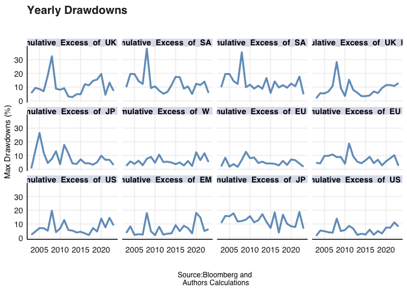

# Goal

-   what is the performance of dividend portfolios.

-   interested in regional performance of indexes that are constrcuted
    either through HY or DG growth as signals

-   the next chunk achieves and now dividend portfolios are proxies for
    their jurisdiction.

``` r
# loadings
pacman::p_load("xts", "tidyverse", "tbl2xts", "PerformanceAnalytics", 
               "lubridate", "glue", "zoo")

df<- readxl::read_xlsx("data/MAD .xlsx")

#  change the column names for ease of analysis

geographical_codenames <- c("UK_HY", "EM_HY", "UK", "EM", "UK_HY_B", "UK_B", "JP_HY", "EU", "US_HY", "US", "W_HY", "W", "EU_DG", "EU_2", "JP_DG", "US_DG", "US_2", "JP", "SA_DG", "SA", "SA_HY", "EU_HY", "W_HY", "W")

colnames(df)[2:23] <- geographical_codenames
```

    ## Warning in colnames(df)[2:23] <- geographical_codenames: number of items to
    ## replace is not a multiple of replacement length

# Goal and Steps to Acheive them

-   Look at aggregate return effects across regions.
-   Stratify by interest rate and market volatility.
-   Assess return consistency.
-   and get an idea of risk attributes of constituents - maybe drawdowns
    could be a tool that we could employ.

# But first, lets describe what constitutes these indexes

-   we need to classify by style what the index offers. There are value,
    these are stock that trade below their perceived intrinsic value.

-   Next, we consider high yield and growth in dividends per share as
    our value signals. Why? The indexes we investigate are return
    oriented factor based strategies, that dividend yield can be either
    absolute value or growth.

-   HY, are companies that have a history of paying high dividends per
    share or have dividend yield . if we hold the payout ratio constant,
    that yield is a function of earnings yield. To achieve that HY
    status, its either earnings are high or price is low. They are
    typically in industries such as telecoms and utilities, and REITS
    (real estate assets) have cash flows that are more steady and
    predictable, which enables them to distribute a larger dividend.
    These businesses typically have better-developed business models and
    depend less on expansion to produce returns. These companies carry
    high risk of financial distress, because of being part of a value
    trap.

-   DG, are companies that have experienced, significant grow its
    dividend distribution. In other words, have seen their dividend
    yield ratio go up with time. This could be a function of either, the
    payout ratio, or earnings yield or both. Companies in this category
    typically have higher-quality, cash-rich operations that perform
    well in both up and down markets and can provide excess returns
    throughout a complete market cycle. There are less likely to
    experience losses when interest rates are rising.

-   in a nutshell, companines that display the ability to increase their
    dividend overtime are considered to be much safer, because there
    have good cash management practices but lack of investmnet
    opportunities. whereas, high dividend payers, that are more
    vumnerable to financial distress can be catergorized as the more
    risky companies.

The next table just shows each index and its benchmark, for ease of
analysis later.

-   The data used is from 20-09-03 to 20-09-23, 20 years because that is
    the maximum we could retrive for all indexes on Bloomberg.

``` r
library(kableExtra)
```

    ## 
    ## Attaching package: 'kableExtra'

    ## The following object is masked from 'package:dplyr':
    ## 
    ##     group_rows

``` r
indexes <- readxl::read_xlsx("data/Index Description.xlsx")

kable(indexes)
```

<table>
<thead>
<tr>
<th style="text-align:left;">
TICKER
</th>
<th style="text-align:left;">
NAME
</th>
<th style="text-align:left;">
Benchmark Ticker
</th>
<th style="text-align:left;">
Benchmark Name
</th>
<th style="text-align:left;">
Geography
</th>
</tr>
</thead>
<tbody>
<tr>
<td style="text-align:left;">
FUDP
</td>
<td style="text-align:left;">
FTSE UK Dividend+ Index
</td>
<td style="text-align:left;">
TUKXG
</td>
<td style="text-align:left;">
FTSE 100 Total Return Index GBP
</td>
<td style="text-align:left;">
UK
</td>
</tr>
<tr>
<td style="text-align:left;">
M2EFDY
</td>
<td style="text-align:left;">
MSCI EM Emerging Markets High Dividend Yield Gross Total Return USD
Index
</td>
<td style="text-align:left;">
GDUEEGF
</td>
<td style="text-align:left;">
MSCI Daily TR Gross EM USD
</td>
<td style="text-align:left;">
EM
</td>
</tr>
<tr>
<td style="text-align:left;">
M2GBDY
</td>
<td style="text-align:left;">
MSCI United Kingdom High Dividend Yield Gross Total Return USD Index
</td>
<td style="text-align:left;">
GDDUUK
</td>
<td style="text-align:left;">
MSCI UK Gross Total Return USD Index
</td>
<td style="text-align:left;">
UK
</td>
</tr>
<tr>
<td style="text-align:left;">
M2JPDY
</td>
<td style="text-align:left;">
MSCI Japan High Dividend Yield Gross Total Return USD
</td>
<td style="text-align:left;">
TPXDDVD
</td>
<td style="text-align:left;">
Topix Total Return Index JPY
</td>
<td style="text-align:left;">
JP
</td>
</tr>
<tr>
<td style="text-align:left;">
M2USADVD
</td>
<td style="text-align:left;">
MSCI USA Hdy Gross Total Return USD Index
</td>
<td style="text-align:left;">
GDDUUS
</td>
<td style="text-align:left;">
MSCI Daily TR Gross USA USD
</td>
<td style="text-align:left;">
US
</td>
</tr>
<tr>
<td style="text-align:left;">
M2WDHDVD
</td>
<td style="text-align:left;">
MSCI World HIGH DIVIDEND YIELD Gross Total Return Total Return USD Index
</td>
<td style="text-align:left;">
GDDUWI
</td>
<td style="text-align:left;">
MSCI Daily TR Gross World USD
</td>
<td style="text-align:left;">
Global
</td>
</tr>
<tr>
<td style="text-align:left;">
SPDAEET
</td>
<td style="text-align:left;">
S&P Europe 350 Dividends Aristocrats Total Return Index
</td>
<td style="text-align:left;">
SPTR350E
</td>
<td style="text-align:left;">
S&P Europe 350 Gross Total Return Index
</td>
<td style="text-align:left;">
EU
</td>
</tr>
<tr>
<td style="text-align:left;">
SPJXDAJT
</td>
<td style="text-align:left;">
S&P/JPX Dividend Aristocrats Total Return Index
</td>
<td style="text-align:left;">
SPXT
</td>
<td style="text-align:left;">
S&P 500 Total Return Index
</td>
<td style="text-align:left;">
JP
</td>
</tr>
<tr>
<td style="text-align:left;">
SPDAUDT
</td>
<td style="text-align:left;">
S&P 500 Dividend Aristocrats Total Return Index
</td>
<td style="text-align:left;">
SPXT
</td>
<td style="text-align:left;">
S&P 500 Total Return Index
</td>
<td style="text-align:left;">
US
</td>
</tr>
<tr>
<td style="text-align:left;">
SPSADAZT
</td>
<td style="text-align:left;">
S&P South Africa Dividend Aristocrats Index ZAR Gross TR
</td>
<td style="text-align:left;">
JALSH
</td>
<td style="text-align:left;">
FTSE/JSE Africa All Share Index
</td>
<td style="text-align:left;">
SA
</td>
</tr>
<tr>
<td style="text-align:left;">
TJDIVD
</td>
<td style="text-align:left;">
FTSE/JSE Dividend+ Index Total Return Index
</td>
<td style="text-align:left;">
JALSH
</td>
<td style="text-align:left;">
FTSE/JSE Africa All Share Index
</td>
<td style="text-align:left;">
SA
</td>
</tr>
<tr>
<td style="text-align:left;">
M2EUGDY
</td>
<td style="text-align:left;">
MSCI Europe Ex UK High Dividend Yield Gross Total Return USD Index
</td>
<td style="text-align:left;">
GDDUE15X
</td>
<td style="text-align:left;">
MSCI Daily TR Gross Europe Ex UK USD
</td>
<td style="text-align:left;">
EU
</td>
</tr>
</tbody>
</table>

We want to investigate the performance of dividend paying portfolios
across different regions. Firstly we will asess the performance of
dividend portfolios over market cycles and interest rate regimes.
dynamic performance measures and risk analysis of these portfolios. in
essence, why do these portfolios work or not and when they seem to add
value to a portfolio. We also high the distinction in growth versus HY
performance.

So, Return, Risk and a combination of the two (IR) will guide the
analysis.

# Objective

Literature has shown that they provide greater excess return over time
versus the s&p because the dividend component over and above the capital
gains. We expand this to other indices, FTSE, MSCI and try to pick up
overall value proposition of dividend indices.

-   So its risk and return that we need to evaluate, so do they provide
    that excess return over time that is significantly better than its
    parent index.

-   If they do what are the drivers, we note the construction of the
    indexes by the different providers. are they exposed to higher risk
    assets. lets mention the composition of different sectors in the
    index. are some sectors prone to paying higher dividend than others
    and what is the relationship between return and dividend paynig
    stock.

-   if they do provide more return do they give more risk. what measure
    of risk can we give to illustrate this and how do these indexes
    cover against these risks of the value trap. What other measures of
    risk will be important to measure over time for these portfolios in
    the various regions. Mentioning the correlations to market is
    important

-   finally we consider south African portfolios, are they able to
    consistently give a return. Lets use the sharpe ratios to determine
    the consistency of the portfolios.

## Compounding Returns, Aggregate effects of Portfolios

-   calculate excess returns as the monthly difference return for index
    and benchmark, then geometrically chain the excess return to compute
    the cumulative excess returns.

-   correct for differing inception dates. The indices across regions
    have different inception dates therefore not purely comparable
    across regions. To correct for this we start the series will start
    from the first date for all indices and standardized to 1, ie all
    indices start from the same point. However these indices are not
    purely comparable, inceptions date may lead to differing momentum
    effects.

With that caveat, lets start the analysis.

``` r
source("code/simpleexcessreturn.R")
source("code/EXCESSRETURN.R")
library(glue)
library(stats)

#   calculate simple returns just simple excess returns
a <- df %>% My_excess_return(., "UK_HY", "UK") 
b <- df %>% My_excess_return(., "UK_HY_B", "UK_B")

c <- df %>% My_excess_return(., "US_HY", "US")
d <- df %>% My_excess_return(., "US_DG", "US_2")

e <- df %>% My_excess_return(., "EU_HY", "EU")
f <- df %>% My_excess_return(., "EU_DG", "EU_2")

g <- df %>% My_excess_return(., "JP_HY", "JP")
h <- df %>% My_excess_return(., "JP_DG", "JP")

i <- df %>% My_excess_return(., "EM_HY", "EM")

j <- df %>% My_excess_return(., "SA_HY", "SA")
k <- df %>% My_excess_return(., "SA_DG", "SA")

l <- df %>% My_excess_return(., "W_HY", "W")


# Table to describe excess returns


excess_return_df <- list( a, b, c, d, e,f,g,h,i,j,k, l) %>%
  reduce(inner_join, by='date')

table_df <- excess_return_df %>% 
  gather(Regions, Cumulative_Excess_Return, -date) %>% 
  group_by(Regions) %>% 
  summarise("Start Date" = first(date) , "Total Years"  = round( n()/12,0),  Median = median(Cumulative_Excess_Return),  "Cumulative Excess Return" = last(Cumulative_Excess_Return))

table_df
```

    ## # A tibble: 12 × 5
    ##    Regions       `Start Date`        `Total Years` Median Cumulative Excess Re…¹
    ##    <chr>         <dttm>                      <dbl>  <dbl>                  <dbl>
    ##  1 Cumulative_E… 2003-08-08 00:00:00            20  0.728                  0.730
    ##  2 Cumulative_E… 2003-08-08 00:00:00            20  0.822                  0.863
    ##  3 Cumulative_E… 2003-08-08 00:00:00            20  0.980                  1.03 
    ##  4 Cumulative_E… 2003-08-08 00:00:00            20  0.925                  0.897
    ##  5 Cumulative_E… 2003-08-08 00:00:00            20  0.678                  0.832
    ##  6 Cumulative_E… 2003-08-08 00:00:00            20  1.05                   0.796
    ##  7 Cumulative_E… 2003-08-08 00:00:00            20  1.14                   0.784
    ##  8 Cumulative_E… 2003-08-08 00:00:00            20  2.38                   5.01 
    ##  9 Cumulative_E… 2003-08-08 00:00:00            20  1.41                   1.53 
    ## 10 Cumulative_E… 2003-08-08 00:00:00            20  0.729                  0.693
    ## 11 Cumulative_E… 2003-08-08 00:00:00            20  0.916                  1.02 
    ## 12 Cumulative_E… 2003-08-08 00:00:00            20  0.960                  1.09 
    ## # ℹ abbreviated name: ¹​`Cumulative Excess Return`

-   notice that growth portfolios dont add value, SA offers similar to
    HY and DG. Whats the reason?

-   HY did good in most advanced market economies. Gving more than 1X in
    excess cumulatively, the best being UK assets high yeild. EM not so
    well on a cumulative basis

## Stratification

-   to get a more nuanced picture of the performance over time, but
    first

-   some settings - top percentile is 95th and bottom is 5 percentile.

``` r
#   get the vol data and get some dates

 vol_data <- readxl::read_xlsx("data/volatility for indexes.xlsx") %>% gather(index, px , -Date) %>% 
  mutate(ret = px/lag(px)-1, RollSD = RcppRoll::roll_sd(1 + ret, 12, fill = NA, align = "right") * 
             sqrt(12)) %>% 
    filter(!is.na(RollSD))
```

``` r
# # get the top quartile and bottom quartile
 strat_df <- vol_data %>% filter(index == "VIX") %>%  mutate(topQ = quantile(RollSD, probs = 0.95), 
               botQ = quantile(RollSD, probs = 0.05),
               Strat = ifelse(RollSD >= topQ, "HiVol", 
                           ifelse(RollSD <= botQ, "LowVol", "Normal_Vol")))
 
# # US strat
 
 hivol_per_vector_us <- strat_df %>% filter(Strat %in% "HiVol") %>% pull(Date)
 lovol_per_vector_us <- strat_df %>% filter(Strat %in% "LowVol") %>% pull(Date)

 # UK 

 strat_df <-vol_data %>% filter(index == "IVIUK") %>% mutate(topQ = quantile(RollSD, probs = 0.95), 
               botQ = quantile(RollSD, probs = 0.05),
              Strat = ifelse(RollSD >= topQ, "HiVol", 
                          ifelse(RollSD <= botQ, "LowVol", "Normal_Vol")))
# 
 hivol_per_vector_uk  <- strat_df %>% filter(Strat %in% "HiVol") %>% pull(Date)
 lovol_per_vector_uk  <- strat_df %>% filter(Strat %in% "LowVol") %>% pull(Date)
#  EU 
 
 strat_df <-vol_data %>% filter(index == "V2X") %>% mutate(topQ = quantile(RollSD, probs = 0.95), 
               botQ = quantile(RollSD, probs = 0.05),
              Strat = ifelse(RollSD >= topQ, "HiVol", 
                          ifelse(RollSD <= botQ, "LowVol", "Normal_Vol")))
# 
 hivol_per_vector_eu  <- strat_df %>% filter(Strat %in% "HiVol") %>% pull(Date)
 lovol_per_vector_eu  <- strat_df %>% filter(Strat %in% "LowVol") %>% pull(Date) 
# # SA 

 strat_df <-vol_data %>% filter(index == "SAVIT40") %>% mutate(topQ = quantile(RollSD, probs = 0.95), 
               botQ = quantile(RollSD, probs = 0.05),
               Strat = ifelse(RollSD >= topQ, "HiVol", 
                           ifelse(RollSD <= botQ, "LowVol", "Normal_Vol")))
# 
 hivol_per_vector_sa <- strat_df %>% filter(Strat %in% "HiVol") %>% pull(Date)
 lovol_per_vector_sa <- strat_df %>% filter(Strat %in% "LowVol") %>% pull(Date)

#  High Vol df 
 
source("code/Stratifier.R")
  
stratifying_df <-  bind_rows(
 stratifier(df, "EU_HY", "EU", hivol_per_vector_eu, "High Vol" ),
 stratifier(df, "EU_DG", "EU_2", hivol_per_vector_eu, "High Vol" ),
 stratifier(df, "UK_HY", "UK", hivol_per_vector_eu, "High Vol" ),
 stratifier(df, "UK_HY_B", "UK", hivol_per_vector_eu, "High Vol"),
 stratifier(df, "JP_HY", "JP", hivol_per_vector_us, "High Vol"),
 stratifier(df, "JP_DG", "JP", hivol_per_vector_us, "High Vol"),
 stratifier(df, "EM_HY", "EM", hivol_per_vector_us, "High Vol"),
 stratifier(df, "SA_HY", "SA", hivol_per_vector_sa, "High Vol"),
 stratifier(df, "SA_DG", "SA", hivol_per_vector_sa, "High Vol"),
 stratifier(df, "US_HY", "US", hivol_per_vector_us, "High Vol"), 
 stratifier(df, "US_DG", "US", hivol_per_vector_us, "High Vol"), 
 stratifier(df , "W_HY", "W", hivol_per_vector_us, "High Vol"), 
 stratifier(df, "EU_HY", "EU", lovol_per_vector_eu, "Low Vol Period" ),
 stratifier(df, "EU_DG", "EU_2", lovol_per_vector_eu, "Low Vol Period" ),
 stratifier(df, "UK_HY", "UK", lovol_per_vector_eu, "Low Vol Period" ),
 stratifier(df, "UK_HY_B", "UK", lovol_per_vector_eu, "Low Vol Period" ),
 stratifier(df, "JP_HY", "JP", lovol_per_vector_us, "Low Vol Period" ),
 stratifier(df, "JP_DG", "JP", lovol_per_vector_us, "Low Vol Period" ),
 stratifier(df, "EM_HY", "EM", lovol_per_vector_us, "Low Vol Period" ),
 stratifier(df, "SA_HY", "SA", lovol_per_vector_sa, "Low Vol Period" ),
 stratifier(df, "SA_DG", "SA", lovol_per_vector_sa, "Low Vol Period" ),
 stratifier(df, "US_HY", "US", lovol_per_vector_us, "Low Vol Period" ), 
 stratifier(df, "US_DG", "US", lovol_per_vector_us, "Low Vol Period" ), 
 stratifier(df, "W_HY", "W", lovol_per_vector_us, "Low Vol Period")
 )

stratifying_df %>% arrange(Name)
```

    ## # A tibble: 24 × 4
    ##    Name   `Market Period`  Days `Annualized Return (%)`
    ##    <glue> <chr>           <int>                   <dbl>
    ##  1 EM_HY  High Vol          179                  -17.7 
    ##  2 EM_HY  Low Vol Period    179                   21.0 
    ##  3 EU_DG  High Vol          224                   -2.49
    ##  4 EU_DG  Low Vol Period    221                    6.76
    ##  5 EU_HY  High Vol          224                    7.22
    ##  6 EU_HY  Low Vol Period    221                   12.9 
    ##  7 JP_DG  High Vol          179                   45.5 
    ##  8 JP_DG  Low Vol Period    179                  -10.7 
    ##  9 JP_HY  High Vol          179                   -3.35
    ## 10 JP_HY  Low Vol Period    179                  198.  
    ## # ℹ 14 more rows

-   not entirely confident with my methodology and I need help on this.
-   after stratification i simple calc returns similar to having the
    full sample of dates. I knowledge that this may lead suspicious
    results not be enough data points to string good representation of
    returns
-   but general trends for HY indexes. EM HY \> Low Vol. EU_HY\> Hi Vol.
    JP_HY \> Low Vol. SA_HY \>High Vol. UK_HY (Both) Low Vol. US \_HY \>
    Low vol and W_HY \> Low Vol.
-   and DG . EU_DG \> Low vol . JP\> High Vol. SA \> HI Vol, US \>
    Low_Vol

Within regions SA_HY(H), UK_HY_B(L), US_DG(L), EM_HY(L), EU_HY(L),
JP_HY(L). So this simply means that for our different portfolios, HY
performs well and mostly in low volatile periods. Linking that back to
our definition for HY index assets it is rationale that most of the
value stock that are vulnerable to financial distress would find favor
from investors in a very risky environment (Low volatility).

# Interest rate cycles

Given a series of central bank interest rates. I want to get dates of n
consecutive interest rate changes.

To do this I will

-   create a column that conditions if there was a rate change or nt.
-   apply a rolling function that counts a desired number of consistent
    hikes or cuts or neutral/hold period.
-   similar to the vol, aggregate performance in those dates.

``` r
rate_data <- readxl::read_xlsx("data/Policy Rates.xlsx") 

names <- c("Date", "US", "UK", "JP", "ECB", "SA")

colnames(rate_data) <- names

US_rates <- rate_data %>% select(Date, US)
UK_rates <- rate_data %>% select(Date, UK)
JP_rates <- rate_data %>% select(Date, JP)
SA_rates <- rate_data %>% select(Date, SA)
ECB_rates <- rate_data %>% select(Date, ECB)
# Get Rates for the US
source("code/Interest_Regime.R")


#  rename the columns for the function to work

Regime_df <- Regime_change_df(US_rates, "US", 5)
Hiking_date_vector_us <- Regime_df %>% filter(regime %in% "Hiking") %>% pull(Date)
Cutting_date_vector_us <- Regime_df %>% filter(regime %in% "Cutting") %>% pull(Date)
Neutral_date_vector_us <- Regime_df %>% filter(regime %in% "Neutral") %>% pull(Date) 

Regime_df <- Regime_change_df(UK_rates, "UK", 5)
Hiking_date_vector_uk <- Regime_df %>% filter(regime %in% "Hiking") %>% pull(Date)
Cutting_date_vector_uk <- Regime_df %>% filter(regime %in% "Cutting") %>% pull(Date)
Neutral_date_vector_uk <- Regime_df %>% filter(regime %in% "Neutral") %>% pull(Date) 

Regime_df <- Regime_change_df(JP_rates, "JP", 5)
Hiking_date_vector_jp <- Regime_df %>% filter(regime %in% "Hiking") %>% pull(Date)
Cutting_date_vector_jp <- Regime_df %>% filter(regime %in% "Cutting") %>% pull(Date)
Neutral_date_vector_jp <- Regime_df %>% filter(regime %in% "Neutral") %>% pull(Date) 

Regime_df <- Regime_change_df(SA_rates, "SA", 5)
Hiking_date_vector_sa <- Regime_df %>% filter(regime %in% "Hiking") %>% pull(Date)
Cutting_date_vector_sa <- Regime_df %>% filter(regime %in% "Cutting") %>% pull(Date)
Neutral_date_vector_sa <- Regime_df %>% filter(regime %in% "Neutral") %>% pull(Date) 

Regime_df <- Regime_change_df(ECB_rates, "ECB", 5)
Hiking_date_vector_eu <- Regime_df %>% filter(regime %in% "Hiking") %>% pull(Date)
Cutting_date_vector_eu <- Regime_df %>% filter(regime %in% "Cutting") %>% pull(Date)
Neutral_date_vector_eu <- Regime_df %>% filter(regime %in% "Neutral") %>% pull(Date) 
# Hiking Performance

Hiking_performance <-  bind_rows(
 stratifier(df, "EU_HY", "EU", Hiking_date_vector_eu, "Hiking" ),
 stratifier(df, "EU_DG", "EU_2", Hiking_date_vector_eu, "Hiking" ),
 stratifier(df, "UK_HY", "UK", Hiking_date_vector_uk, "Hiking" ),
 stratifier(df, "UK_HY_B", "UK", Hiking_date_vector_uk, "Hiking" ),
 stratifier(df, "EM_HY", "EM", Hiking_date_vector_us, "Hiking"),
 stratifier(df, "SA_HY", "SA", Hiking_date_vector_sa, "Hiking" ),
 stratifier(df, "SA_DG", "SA", Hiking_date_vector_sa, "Hiking" ),
 stratifier(df, "US_HY", "US", Hiking_date_vector_us, "Hiking" ), 
 stratifier(df, "US_DG", "US", Hiking_date_vector_us, "Hiking" )
 )

#  Cutting Perfromance

Cutting_performance <-  bind_rows(
 stratifier(df, "EU_HY", "EU", Cutting_date_vector_eu, "Cut" ),
 stratifier(df, "EU_DG", "EU_2", Cutting_date_vector_eu, "Cut" ),
 stratifier(df, "UK_HY", "UK", Cutting_date_vector_uk, "Cut" ),
 stratifier(df, "UK_HY_B", "UK", Cutting_date_vector_uk, "Cut" ),
 stratifier(df, "EM_HY", "EM", Cutting_date_vector_us, "Cut"),
 stratifier(df, "SA_HY", "SA", Cutting_date_vector_sa, "Cut" ),
 stratifier(df, "SA_DG", "SA", Cutting_date_vector_sa, "Cut" ),
 stratifier(df, "US_HY", "US", Cutting_date_vector_us, "Cut" ), 
 stratifier(df, "US_DG", "US", Cutting_date_vector_us, "Cut" )
 )

# Nuetral 

Nuetral_perfromance <-  bind_rows(
 stratifier(df, "EU_HY", "EU", Neutral_date_vector_eu, "Neutral" ),
 stratifier(df, "EU_DG", "EU_2", Neutral_date_vector_eu, "Neutral" ),
 stratifier(df, "UK_HY", "UK", Neutral_date_vector_uk, "Neutral" ),
 stratifier(df, "UK_HY_B", "UK", Neutral_date_vector_uk, "Neutral" ),
 stratifier(df, "JP_HY", "JP", Neutral_date_vector_jp, "Neutral" ),
 stratifier(df, "JP_DG", "JP", Neutral_date_vector_jp, "Neutral" ),
 stratifier(df, "EM_HY", "EM", Neutral_date_vector_us, "Neutral"),
 stratifier(df, "SA_HY", "SA", Neutral_date_vector_sa, "Neutral" ),
 stratifier(df, "SA_DG", "SA", Neutral_date_vector_sa, "Neutral" ),
 stratifier(df, "US_HY", "US", Neutral_date_vector_us, "Neutral" ), 
 stratifier(df, "US_DG", "US", Neutral_date_vector_us, "Neutral" )
 )

CB_df <- bind_rows(Nuetral_perfromance, 
 Cutting_performance, Hiking_performance) %>% arrange(Name)

CB_df
```

    ## # A tibble: 29 × 4
    ##    Name   `Market Period`  Days `Annualized Return (%)`
    ##    <glue> <chr>           <int>                   <dbl>
    ##  1 EM_HY  Neutral            20                   -99.5
    ##  2 EM_HY  Cut                15                   -82.9
    ##  3 EM_HY  Hiking             36                   485. 
    ##  4 EU_DG  Neutral            29                   730. 
    ##  5 EU_DG  Cut                14                  4394. 
    ##  6 EU_DG  Hiking             27                   104. 
    ##  7 EU_HY  Neutral            29                   -49.5
    ##  8 EU_HY  Cut                14                   -42.6
    ##  9 EU_HY  Hiking             27                   -72.6
    ## 10 JP_DG  Neutral            49                   126. 
    ## # ℹ 19 more rows

``` r
#  need to aggregate that into a single number 
```

-   confident with this stratification
-   huge idiosyncratic factors that have influenced the results thus
    performance of equity within each region. We will not get into that
    for now.
-   for HY returns, EM H\>C\>N. EU N\>C\>H, SA H\>C\>N, UK H\>C\>N , US
    C\>H\>N
-   for DG returns, US H\>C\>N, SA H\>C\>N, EU N\>C\>H
-   so HY indexes generally perform well in rising interest rate
    environments and have the lowest return in Neutral interest rate
    environments and DG dividend growth strategies follow a similar
    pattern.
-   Similar to the market cycle stratification, some regimes have less
    data points than other which may affect the returns.

Within geographies then, EM - HY (H), EU - DG (C), JP - HY (N) , SA-DG
(H) , UK HY - B (H), US_DG (H), So mostly perform well in Hiking periods
but their strategies are evenly split given our sample. However there is
no clear relationship between which strategy works best. This
contradicts what some pundits advocate, they believe that investors
looking for yield in low rate environments would cause the price action
to favor such stock (we have only seen this in the EU DG ).

# Rolling consistency

-   How much bang for buck do these strategies give and how consistent
    are there at acheiving said return

To do this we will first

-   calculate the returns for both benchmark and index and get the
    tracking error of the each index to its benchmark.
-   then simply on a rolling basis depict the movement of each pair.
-   we then graph that.

``` r
#  source 

source("code/InformationRatioRoll.R")

a <-  df %>% Information_Ratio_Roll(., "EU_HY", "EU", 20030808, 36)
b <-  df %>% Information_Ratio_Roll(., "EU_DG", "EU_2",20030808, 36)
 c <- df %>% Information_Ratio_Roll(., "UK_HY", "UK", 20030808, 36)
 d <- df %>% Information_Ratio_Roll(., "UK_HY_B", "UK", 20030808, 36)
 e <- df %>% Information_Ratio_Roll(., "JP_HY", "JP", 20030808, 36)
 f <- df %>% Information_Ratio_Roll(., "JP_DG", "JP", 20030808, 36)
 g <- df %>% Information_Ratio_Roll(., "EM_HY", "EM", 20030808, 36)
 h <- df %>% Information_Ratio_Roll(., "SA_HY", "SA", 20030808, 36)
 i <- df %>% Information_Ratio_Roll(., "SA_DG", "SA", 20030808, 36)
 j <- df %>% Information_Ratio_Roll(., "US_HY", "US", 20030808, 36)
 k <- df %>% Information_Ratio_Roll(., "US_DG", "US_2", 20030808, 36)

consistency_df <- list(a, b, c, d, e,f,g,h,i,j,k) %>%
  reduce(inner_join, by='date') %>% 
  gather(IR , ret, -date) 
 
plot <- consistency_df %>%   ggplot() + 
geom_line(aes(date, ret), color = "steelblue", size = 1.1, alpha = 0.8) +
geom_hline(yintercept = 0, color = "red", size = 0.3, alpha = 0.5)+
fmxdat::theme_fmx() + 
facet_wrap(~IR) + 
labs(x = "", y = "Information Ratio", title = "Performance Consistency", subtitle = "Deeply Inconcsistent", caption = "Source:Bloomberg and\n Authors Calculations")
```

    ## Warning: Using `size` aesthetic for lines was deprecated in ggplot2 3.4.0.
    ## ℹ Please use `linewidth` instead.
    ## This warning is displayed once every 8 hours.
    ## Call `lifecycle::last_lifecycle_warnings()` to see where this warning was
    ## generated.

    ## Warning in loadfonts_win(quiet = quiet): OS is not Windows. No fonts registered
    ## with windowsFonts().

``` r
plot
```

 - we
notive choppy IR for the different indexes across regions. - difficult
for strategies to consistently deliver IR above zero across varying
volatiliy and interest rate regimes. - but having said that, lets
consider the redline to be a measure of strategy working or not. - The
UK_HY stands out as one that has struggled to give that bang for buck
effect. - EM and JP HY and JP DG from 2005 to 2015 return positive IR
then since then until the start of 2022 its been negative. - SA indexes
, a tale of two have shown 2010 to 2020 in positive for DG but the SA HY
IR from 2017 to date for HY - US indexes have been mirroring each other.
However difficult to conclude.

We notice that UK HY portfolios have not been working. Whilst SA HY has
deliverd some respectable consistency for several years. However EM \_HY
like the UK since 2015 has delivered negative information ratio. Are
there common risk factors that give opposite effects? \# Drawdowns

Drawdowns give a more detailed picture of the risk attributes of the
constituents of a data series. Their importance for our study is to
uncover latent relationship between performance and drawdown.

``` r
# lets get cumulative returns for our dividend strategies and Max drawdowns

cum_df <- excess_return_df %>% 
  gather(Funds, ret, -date) %>% mutate(Year = format(date, "%Y")) %>% group_by(Year, Funds) %>% summarize(DD = (max(ret) - min(ret))/max(ret)* 100, Range = range(ret)) %>% arrange(desc(Range)) 
```

    ## Warning: Returning more (or less) than 1 row per `summarise()` group was deprecated in
    ## dplyr 1.1.0.
    ## ℹ Please use `reframe()` instead.
    ## ℹ When switching from `summarise()` to `reframe()`, remember that `reframe()`
    ##   always returns an ungrouped data frame and adjust accordingly.
    ## Call `lifecycle::last_lifecycle_warnings()` to see where this warning was
    ## generated.

    ## `summarise()` has grouped output by 'Year', 'Funds'. You can override using the
    ## `.groups` argument.

``` r
 order <- cum_df %>% pull(Funds) %>% unique()

cum_df$Year <- as.Date(paste0(cum_df$Year, "-01-01"))

source("code/order.R")

plot <- cum_df %>% 
  plot_order(., Column = "Funds", Order = order) %>% 
  ggplot() +
  geom_line(aes(Year, DD), color = "steelblue", size = 1.1, alpha = 0.8) + 
fmxdat::theme_fmx() + 
facet_wrap(~Funds) + 
labs(x = "", y = " Max Drawdowns (%)", title = "Yearly Drawdowns", subtitle = "", caption = "Source:Bloomberg and\n Authors Calculations")
```

    ## Warning in loadfonts_win(quiet = quiet): OS is not Windows. No fonts registered
    ## with windowsFonts().

``` r
plot
```

 Draw
downs in this study are defined as the difference between low and high
values of cumulative excess returns within a time period. From our
dividend portfolios we notice that drawdowns are similar in regions and
across strategies.

-   Both indexes in SA have shown decreasing levels in drawdowns.  
-   US, Japan, EM have shown some level of increasing drawdowns.
-   EU most stable. Low levels

# Putting it together

Dividend portfolios either HY or DGPS have overtime give some level of
positive return, as measured by the cumulative return. However, HY
indexes give above average excess return for the sample period and most
portfolios have show no ability to harverst premium to a noticable
effect on portfolio value overtime. From this metric, there is no super
convincing signal that these portfolios give some consistent excess
return.

The moment we stratifying according to different periods of volatility
we notice that during periods of high volatility, its less about the
region and more of the investment strategy that plays a big part in
explaining the performance. SA performs well during these high vol
periods. Unusual given in this time there is a flight to safety and EM
and SA by association will be risky at this time. During periods of low
vol, advanced market portfolios generally give higher returns that in
high vol conditions.

When we consider rolling returns, excess returns for most portfolios
move in a similar direction, generally there are part of the same asset
class, exposed to the same risk factors and should behave the same way.
with the exception the SA portfolios. we notice that over three years,
it has great variance in excess returns. .
